# NewKeepItDroid

A Jetpack Compose note-taking Android app with Room / SQLite operations, real-time search, filtering, and a multi-column grid layout.

## Screenshots

### Home Dark
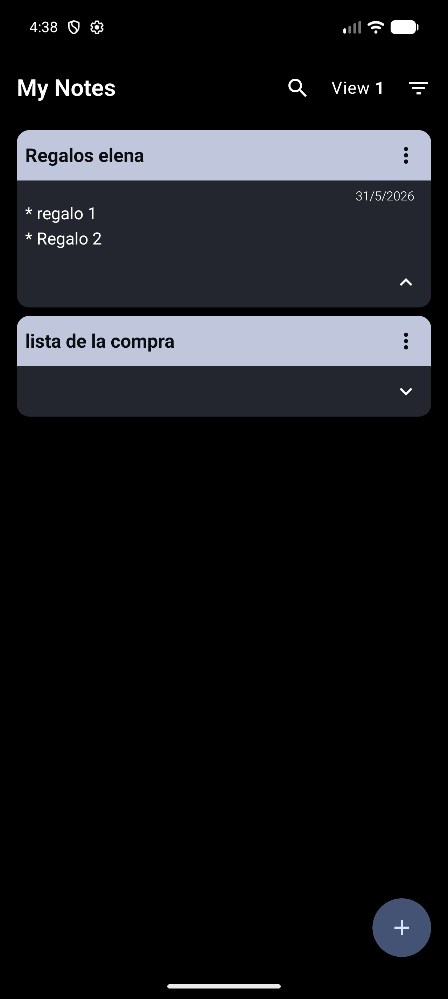

### Home light
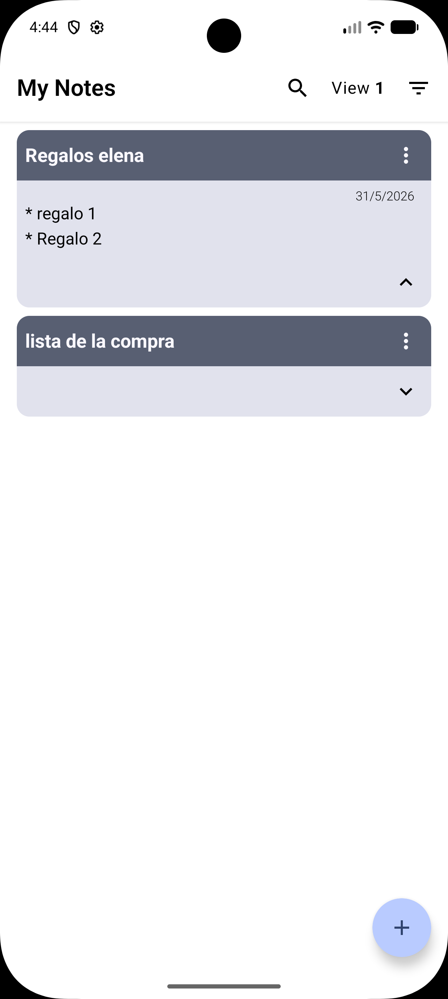

### Filter dark
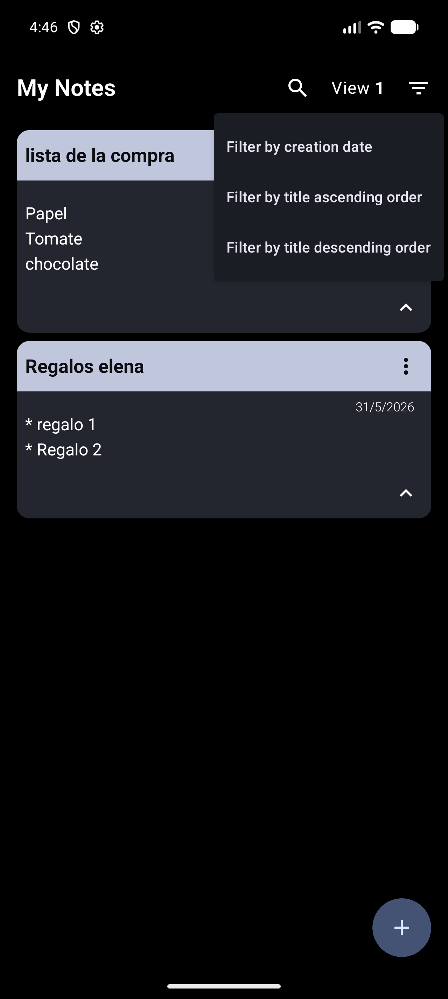

### Filter light
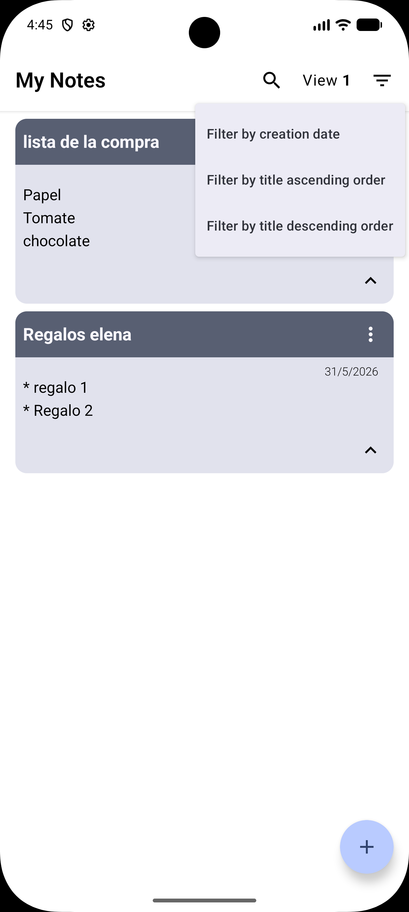

### Views dark
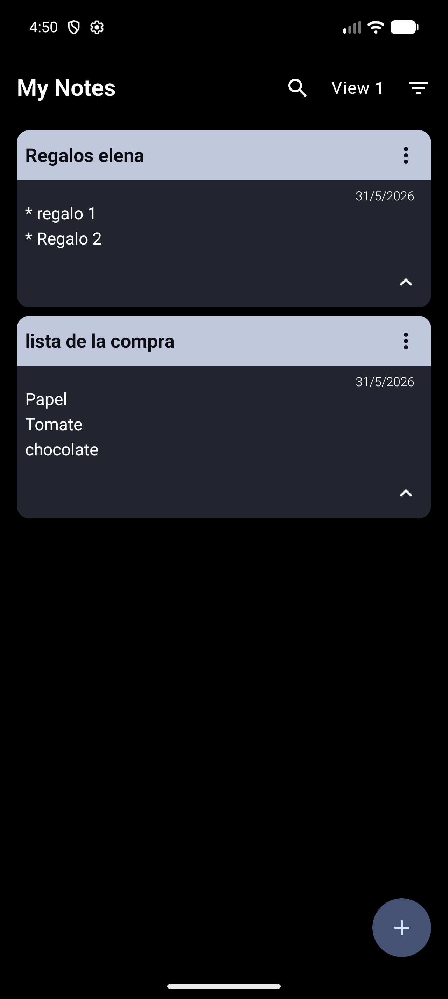
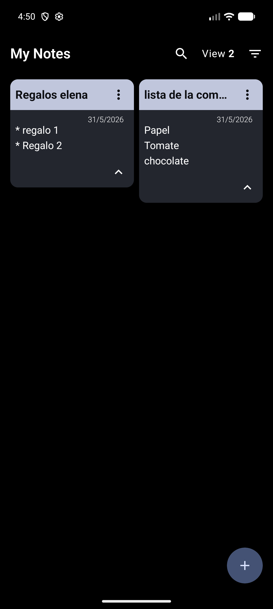

### Views light
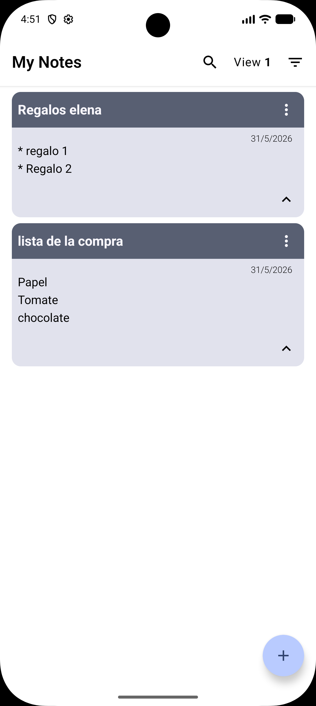
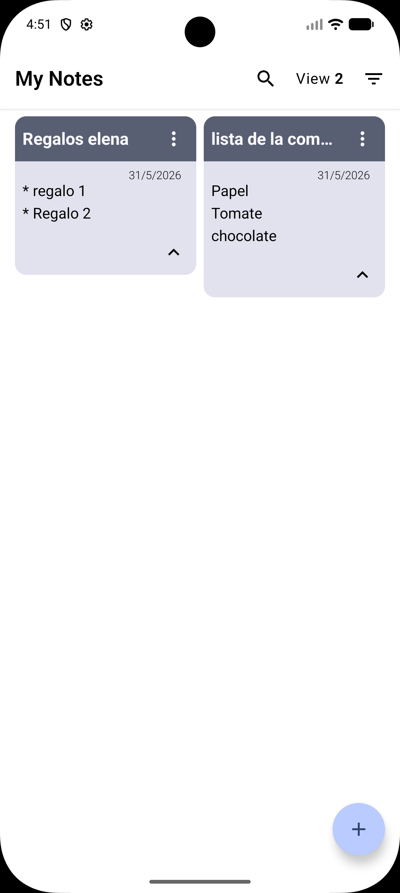

### Edit/Add dark
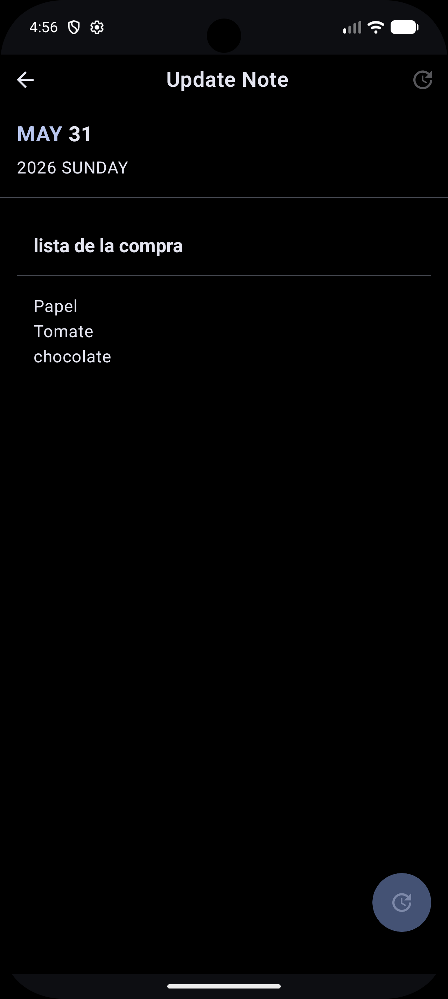
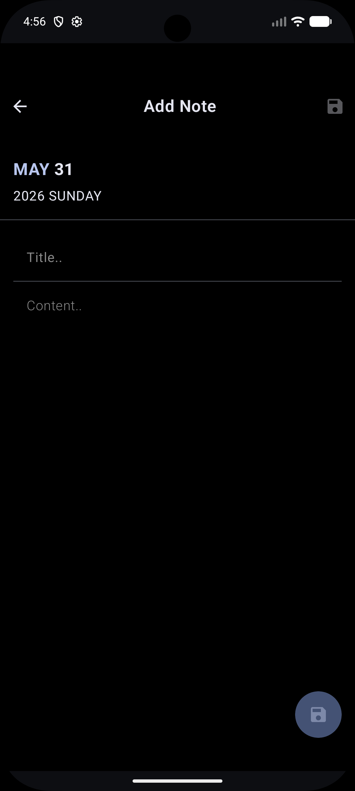

### Edit/Add light
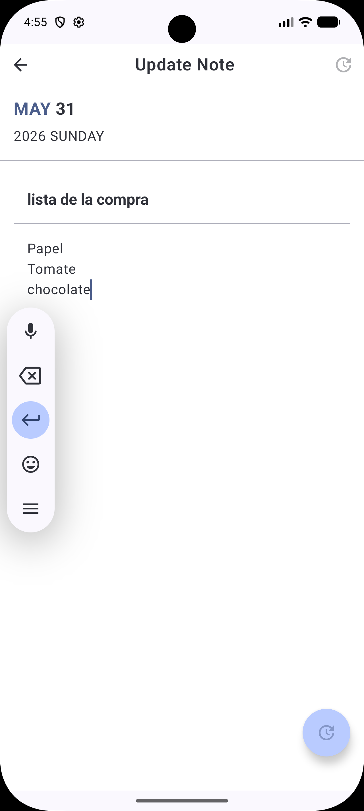
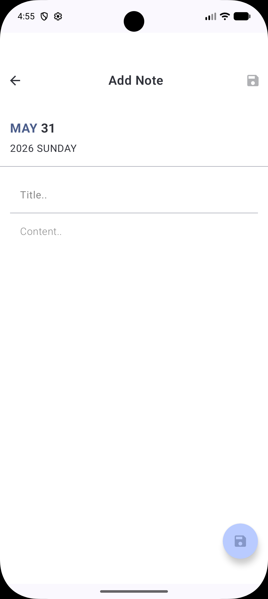

### Search dark
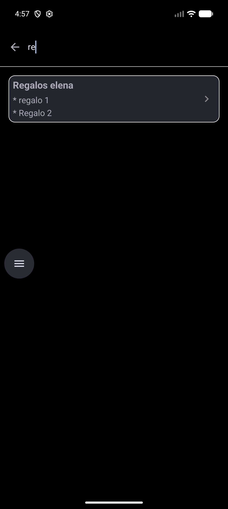

### Search light
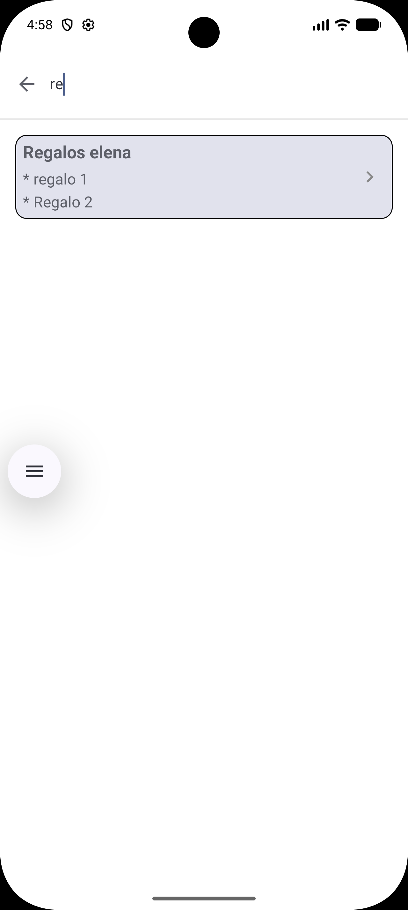

## Features

### Core App
- **Create Note** — Add notes with title and content; auto-generated ID and timestamp
- **Read Notes** — Reactive list via Room `Flow`, ordered by most recent by default
- **Update Note** — Edit existing note's title and/or content
- **Delete Note** — Long-press or dropdown menu on a note card triggers a confirmation dialog

### Search
- **Real-time search** — Material3 `SearchBar` filters as you type
- **Title + content search** — Matches by title first, then by content, with deduplicated results
- **Debounced input** — 200ms delay prevents excessive database queries

### Sorting & Filtering
- By creation date (ascending / descending)
- By title (ascending / descending)
- Dropdown filter menu in the top toolbar

### Multi-Column Grid
- Toggle between 1-column (list) and 2-column (staggered grid) layout
- Tap the **"View N"** text in the top bar to switch

### Note Cards
- Expandable content with `AnimatedVisibility` (auto-collapses if > ~40 words)
- Formatted date (`d/M/yyyy`)
- Single tap → Update screen; long-press → Delete dialog
- Per-card dropdown menu (Edit / Delete)

### Add Note Screen
- Auto-generated date header with colored month name
- Title (max 30 chars) and content input fields
- Input validation before save
- Duplicate detection (case-insensitive title+content check)
- Smart re-save: detects previously inserted note and performs UPDATE instead of INSERT

### Update Note Screen
- Loads existing note by ID and pre-populates fields
- Same validation and duplicate detection as Add screen

### Navigation
- 4 screens: Home, Add, Update (with `noteId` arg), Search
- Slide animations (700ms tween) for all transitions
- Custom back-press handling: close dialog on Home screen, otherwise pop back stack

### Dialogs
- **Delete confirmation** — "Are you sure you want to remove [title]?"
- **Close app confirmation** — "Are you sure you want to close?"

### Theming
- Material3 dynamic colors on Android 12+
- Dark / Light mode support
- Custom scaffold wrapper with configurable background color

## Tech Stack

| Layer | Technology |
|---|---|
| UI | Jetpack Compose + Material3 |
| Architecture | MVVM + Clean Architecture |
| DI | Dagger Hilt |
| Database | Room (with KSP) |
| Navigation | Jetpack Navigation Compose |
| Min SDK | 24 |
| Target SDK | 35 |
| Kotlin | 2.0.0 |
| Gradle | 8.10.2 |
| AGP | 8.8.2 |

## Project Structure

```
app/src/main/java/es/infolojo/newkeepitdroid/
├── NewKeepItDroidApp.kt              # @HiltAndroidApp
├── db/
│   └── NotesDB.kt                     # Room Database
├── di/
│   └── AppModule.kt                   # Hilt DI module
├── domain/
│   ├── data/
│   │   ├── bo/NoteBO.kt               # Business object
│   │   ├── dbo/NoteDBO.kt             # Room entity
│   │   └── mappers.kt                 # DBO <-> BO mappers
│   ├── model/
│   │   ├── DateModel.kt
│   │   ├── DaysOfWeekModel.kt
│   │   └── MonthModel.kt
│   ├── repository/
│   │   └── LocalRepository.kt         # DAO + repository interface
│   └── usecase/
│       ├── DeleteNoteUseCase.kt
│       ├── GetNotesUseCase.kt
│       ├── InsertNoteUseCase.kt
│       ├── IsNoteAlReadyInDataBase.kt
│       ├── SearchNotesUseCase.kt
│       └── UpdateNoteUseCase.kt
├── navigation/
│   ├── NewKeepItDroidNavHost.kt
│   └── ScreensRoutes.kt
├── ui/
│   ├── activities/
│   │   └── main/
│   │       ├── MainActivity.kt
│   │       └── events/MainEvents.kt
│   ├── screens/
│   │   ├── add/                       # AddScreen, AddScreenViewModel
│   │   ├── commons/                   # Reusable components
│   │   ├── home/                      # HomeScreen, HomeScreenViewModel, ItemNote
│   │   ├── search/                    # SearchScreen, SearchScreenViewModel, SearchItemNote
│   │   ├── update/                    # UpdateScreen, UpdateScreenViewModel
│   │   └── vo/                        # View Objects + mappers
│   └── theme/
│       ├── Color.kt
│       ├── Theme.kt
│       ├── ThemeHelper.kt
│       └── Type.kt
└── utils/
    ├── CalendarUtils.kt
    ├── ListExtensions.kt
    ├── MainUtils.kt
    ├── StringExtensions.kt
    └── ToastMaker.kt
```

## Author
This Android App has been developed by: **Antonio José Lojo Ojeda** [ajloinformatico](https://github.com/ajloinformatico).


---
created with ❤️ by [INFOLOJO](https://www.infolojo.es) 🧑‍💻.

